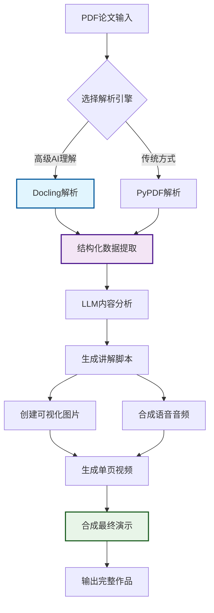

一个基于 LangChain + Pydantic + MoviePy 的智能系统，能够将学术论文自动转换为包含图片、音频讲解和视频演示的完整可视化内容。

## ✨ 核心特性

### 📊 智能内容分析

- **LangChain Express Language** + **Pydantic Parser** 确保结构化数据提取
- **Docling PDF解析**：IBM开源的先进PDF理解引擎，支持复杂文档结构
- 自动将论文分解为 5-8 个核心概念页面
- 支持 ASCII 艺术、公式、图表、流程图等多种可视化形式
- 智能识别表格、图片、公式和章节结构
- 可配置的内容行数和字符数限制

### 🔍 先进PDF处理

- **Docling引擎**：页面布局理解、阅读顺序分析、表格结构识别
- **多后端支持**：DoclingParse（高质量）+ PyPdfium2（高速度）
- **OCR功能**：可选的光学字符识别支持扫描文档
- **结构保持**：完整保留文档的层次结构和元数据
- **格式导出**：支持Markdown、JSON、结构化数据等多种输出

### 🎨 灵活样式系统

- **5种预定义主题**：黑板、白板、学术、现代、终端风格
- 完全可配置的颜色、字体、布局参数
- 支持自定义样式覆盖和扩展

### 🔊 多引擎语音合成

- **Edge TTS**（免费，支持中文）
- **Azure TTS**（高质量商业方案）
- **OpenAI TTS**（多语言支持）
- 15+ 中文语音选择，可调节语速、音调

### 🎬 专业视频制作

- **MoviePy** 驱动的视频合成引擎
- 自动同步图片和音频时长
- 支持转场效果、背景音乐、字幕
- 批量生成单页视频 + 最终合成演示

## 🚀 快速开始

### 安装依赖

```bash
# 安装 Python 依赖
pip install -r requirements.txt

# 安装 Playwright 浏览器
playwright install chromium

# 安装 FFmpeg（用于视频处理）
# Windows: choco install ffmpeg
# macOS: brew install ffmpeg
# Ubuntu: sudo apt install ffmpeg
```

### 基础使用

```bash
# 创建示例论文（首次运行）
python main.py

# 使用Docling引擎生成完整演示
python main.py --paper sample_paper.txt --output-type all --pdf-backend docling

# 启用OCR处理扫描PDF
python main.py --paper scanned_paper.pdf --enable-ocr --pdf-backend docling

# 只生成图片（传统PDF解析）
python main.py --paper paper.pdf --output-type images --style blackboard --pdf-backend pypdf2

# 预览论文结构
python main.py --paper paper.txt --preview
```

### 进阶配置

```bash
# 高级Docling解析 + 自定义样式和音频
python main.py \
  --paper complex_paper.pdf \
  --pdf-backend docling \
  --enable-ocr \
  --style modern \
  --voice-engine edge \
  --voice-name zh-CN-YunyangNeural \
  --speaking-rate 1.2 \
  --script-duration 45

# 最高质量视频输出
python main.py \
  --paper paper.pdf \
  --pdf-backend docling \
  --video-resolution 2560x1440 \
  --video-fps 60 \
  --background-music bgm.mp3
```

## 📁 项目结构

```
paper-visualizer/
├── 📄 models.py              # Pydantic 数据模型
├── 🎨 styles.py              # 样式配置和主题
├── 🧠 langchain_parser.py    # LangChain 解析器
├── 🔍 docling_parser.py      # Docling PDF 解析器
├── 🖼️ image_generator.py     # 图片生成器
├── 🔊 audio_generator.py     # 音频生成器
├── 🎬 video_generator.py     # 视频生成器
├── 🚀 main.py               # 主程序入口
├── 📋 requirements.txt      # 依赖包列表
├── ⚙️ config_example.json   # 配置示例
└── 📖 README.md            # 项目说明
```

## 🎯 工作流程



**关键优势**：

- 🔍 **Docling引擎**：IBM AI驱动的文档理解
- 📊 **结构保持**：完整保留论文的层次和布局
- 🎯 **一键生成**：从PDF到专业视频演示

## 🔧 Docling 优势

### 🚀 为什么选择 Docling？

Docling 是 IBM 开源的下一代文档转换工具，专为复杂 PDF 文档设计，提供先进的文档理解能力：

**🎯 核心优势**

- **页面布局理解**：精确识别文档结构和阅读顺序
- **表格结构识别**：使用 TableFormer 模型准确提取表格
- **公式和图片检测**：智能分类文档中的各种元素
- **多语言支持**：优秀的中文文档处理能力
- **高效性能**：在标准硬件上快速运行

**📊 对比传统方案**
| 特性 | Docling | PyPDF2 | pdfplumber |
|------|---------|--------|------------|
| 布局理解 | ✅ 先进AI模型 | ❌ 基础提取 | ⚠️ 部分支持 |
| 表格识别 | ✅ TableFormer | ❌ 不支持 | ✅ 基础支持 |
| 阅读顺序 | ✅ 智能排序 | ❌ 随机顺序 | ⚠️ 部分支持 |
| 元素分类 | ✅ 11种类型 | ❌ 纯文本 | ⚠️ 基础类型 |
| 处理速度 | ✅ 优化快速 | ✅ 很快 | ⚠️ 中等 |

## 🎨 样式主题展示

### 🖤 Blackboard（黑板风格）

- 黑色背景 + 白/绿文字
- 模拟传统黑板教学
- 适合算法和公式展示

### ⚪ Whiteboard（白板风格）

- 清爽的白色背景
- 现代化设计语言
- 适合商务演示

### 🎓 Academic（学术风格）

- 经典学术论文布局
- 适合正式研究报告

### 🌟 Modern（现代风格）

- 深色 + 亮绿代码风格
- 科技感十足的设计

### 💻 Terminal（终端风格）

- 命令行界面风格
- 适合技术类内容

## 🔧 高级配置

### Docling 解析配置

```python
# 高质量解析（推荐）
python main.py --paper paper.pdf --pdf-backend docling

# 启用OCR处理扫描PDF
python main.py --paper scanned.pdf --pdf-backend docling --enable-ocr

# 高速解析（资源受限环境）
python main.py --paper paper.pdf --pdf-backend pypdf2
```

### 自定义样式配置

```json
{
  "colors": {
    "left_bg_color": "#000000",
    "left_text_color": "#00ff00",
    "accent_color": "#ff6b6b"
  },
  "fonts": {
    "left_font_size": 18,
    "right_font_size": 20
  },
  "layout": {
    "border_radius": 12,
    "panel_padding": 50
  }
}
```

### 多语音引擎配置

```python
# Edge TTS（免费）
audio_config = AudioConfig(
    voice_engine="edge",
    voice_name="zh-CN-XiaoxiaoNeural",
    speaking_rate=1.0
)

# Azure TTS（需要 API Key）
audio_config = AudioConfig(
    voice_engine="azure",
    voice_name="zh-CN-YunxiNeural"
)
```

## 📊 输出示例

运行完成后将生成：

```
📁 paper_presentation/
├── 🖼️ images/
│   ├── page_01_introduction.png
│   ├── page_02_methodology.png
│   └── ...
├── 🔊 audio/
│   ├── audio_01_introduction.wav
│   ├── audio_02_methodology.wav
│   └── ...
├── 🎬 videos/
│   ├── video_01_introduction.mp4
│   ├── video_02_methodology.mp4
│   └── ...
├── 🎯 paper_presentation.mp4    # 最终合成视频
└── 📋 index.html               # 预览索引页
```

## 🔍 命令行参数完整列表

| 参数                 | 说明                                    | 默认值               |
| -------------------- | --------------------------------------- | -------------------- |
| `--paper`            | 论文文件路径                            | 必需                 |
| `--output-type`      | 输出类型 (images/audio/video/all)       | all                  |
| `--pdf-backend`      | PDF解析引擎 (docling/pypdf2/pdfplumber) | docling              |
| `--enable-ocr`       | 启用OCR支持扫描PDF                      | 禁用                 |
| `--style`            | 预定义样式主题                          | blackboard           |
| `--voice-engine`     | 语音引擎 (edge/azure/openai)            | edge                 |
| `--voice-name`       | 语音名称                                | zh-CN-XiaoxiaoNeural |
| `--script-style`     | 讲解风格 (educational/casual/formal)    | educational          |
| `--video-resolution` | 视频分辨率                              | 1920x1080            |
| `--background-music` | 背景音乐文件                            | 无                   |

## 🛠️ 故障排除

### 常见问题

**1. Docling 安装失败**

```bash
# 确保使用最新版本
pip install --upgrade docling

# 如果遇到依赖冲突
pip install docling --no-deps
pip install docling-core docling-ibm-models
```

**2. Playwright 截图失败**

```bash
# 重新安装浏览器
playwright install chromium --force
```

**3. Docling 解析失败**

```bash
# 检查PDF文件是否损坏
# 或切换到传统解析器
python main.py --paper paper.pdf --pdf-backend pypdf2
```

**4. 音频生成失败**

```bash
# 检查网络连接（Edge TTS 需要联网）
# 或切换到本地 TTS 引擎
```

**3. 视频合成失败**

```bash
# 检查 FFmpeg 安装
ffmpeg -version

# Ubuntu/Debian
sudo apt update && sudo apt install ffmpeg

# macOS
brew install ffmpeg
```

**4. 中文字体显示问题**

```bash
# 确保系统安装了中文字体
# 或在样式配置中指定字体路径
```

## 🤝 贡献指南

欢迎提交 Issue 和 Pull Request！

1. Fork 本仓库
2. 创建特性分支 (`git checkout -b feature/amazing-feature`)
3. 提交更改 (`git commit -m 'Add amazing feature'`)
4. 推送到分支 (`git push origin feature/amazing-feature`)
5. 开启 Pull Request

## 📄 许可证

本项目采用 MIT 许可证 - 查看 [LICENSE](LICENSE) 文件了解详情。

## 🙏 致谢

- [Docling](https://github.com/docling-project/docling) - IBM开源的先进文档转换工具
- [LangChain](https://github.com/hwchase17/langchain) - 强大的 LLM 应用框架
- [Pydantic](https://github.com/pydantic/pydantic) - 数据验证库
- [MoviePy](https://github.com/Zulko/moviepy) - 视频处理库
- [Edge TTS](https://github.com/rany2/edge-tts) - 免费的微软语音合成
- [Playwright](https://github.com/microsoft/playwright-python) - 浏览器自动化工具

---

⭐ 如果这个项目对你有帮助，请给个 Star！
